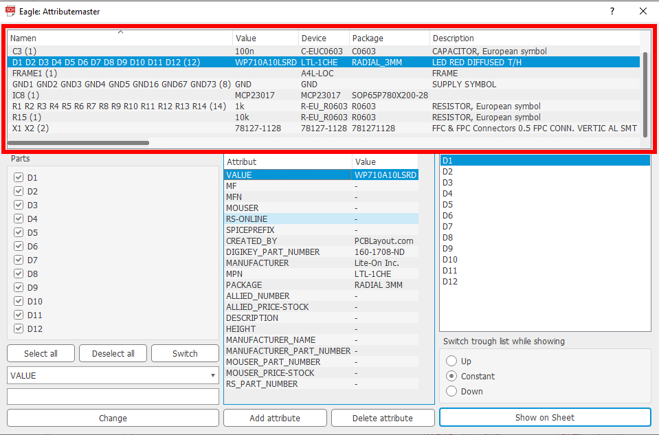

## Attributemaster ULP for Eagle 6.x and higher

The **Attributemaster** allows you to create, modify and delete attributes for multiple parts in your sheet.

This documentation explains the use of:

- The **partlist**
- The **attributelist**
- **modifying** attributes
- **showing** and **selecting** parts in the sheet

###The partlist

By starting the ULP, you'll see a partlist at first place. 
All parts in the sheet are sorted by their values and attributes. All *equal* parts are stored in one row. The first column shows you the names of each equal part followed by their number.

If you scroll right, you'll see all used attributes and the corresponding values for each pack of parts. If some parts don't own an attribute, it's marked with a ` - `.

By **doubleclicking** on a row, the parts are listed below the partlist.

###The attributelist

...shows you all attributes used in your sheet followed by the value given to the *selected* parts. **Doubleclicking** one of the attributes will copy the name and value to the *modification-field*.

 

By clicking *'Add attribute'*, you can create a new attribute for **all checked parts** in the checkboxes. Enter the name of the new attribute in the first inputfield and the value of the new attribute in the second inputfield. *Note: You can leave the value of the new attribute empty. It will be created without any value and therefore be marked with `-`.*

By clicking *'Delete attribute'*, you can delete the attribute selected in the attributelist for **all checked parts** in the checkboxes. 
If the attribute is defined within a library, it can't be deleted and will be recreated with it's *standardvalue*.

###Modifying attributes

On the lower left side of the ULP you can see some checkboxes and the so called *modification-field*. In the Combobox you can select one of all used attributes (and 'VALUE'). Alternatively you can doubleclick in the *attributelist*. By entering a value in the inputflied and clicking *'change'*, the selected attribute of **all checked parts** will get the entered value.

Using the buttons 'Select all', 'Deselect all', and 'Switch', which toggles all checkboxes, gives you a better control of the parts you want to change.

###Showing and selecting parts in the sheet

On the right side of the ULP you can see a list of *all currently selected* parts. By doubleclicking at one part, clicking on *'Show on sheet'* or hitting `Enter`, the selected part will be shown on your sheet. 

You are now in a special *selecting-mode*. By pressing `Alt+S` or `Alt+W` you can switch through *all currently selected parts*. By pressing `Alt+Q`, the current part will be checked or dechecked in the checkboxes, depending on how it was before. **By pressing `Return` you will return to the previous window of *Attributemaster*, with all changes of the checkboxes taken over.**

There is an alternative mode of switching through the parts in the sheet. Below the partlist you can see three Radioboxes, called *'Up'*, *'Constant'* and *'Down'*. By selecting one of these modes, the index of the partlist will change every time you return to the window of the ULP. 

**For example:** If you select '*Down'* and start with the first part in the list, hitting `Enter` and `Return` alternately will make you scroll through the hole list of parts.

*Note: Pressing `Alt+S` or `Alt+W` during the 'selection-mode' will always set the Radiobuttons to 'Constant'.*

##
Special thanks to Hans Achterbahn ([@HansAchterbahn](https://github.com/HansAchterbahn)) for his led-ring project, which I used for testing my code and for creating the example-pictures.
